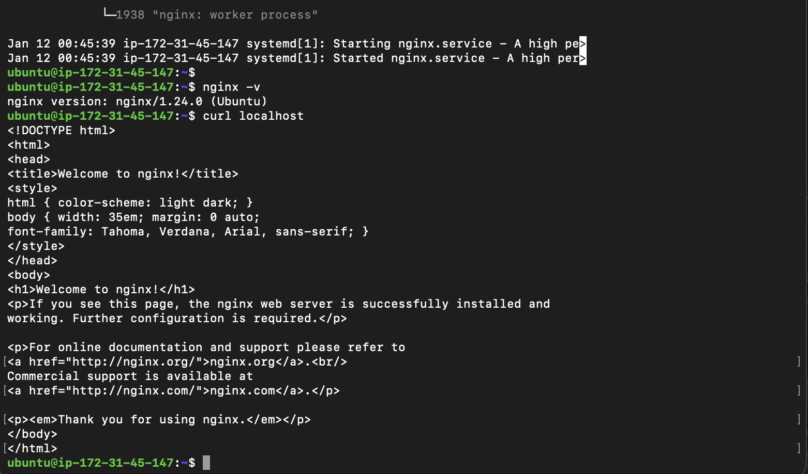

# Networking Project – EC2, NGINX, and DNS

This project documents my learning process deploying a web server using
NGINX on an AWS EC2 instance and exposing it to the internet using DNS.

---

## Technologies Used
- AWS EC2
- Ubuntu Linux
- NGINX
- SSH
- DNS
- Git & GitHub

---

## What I Built
- Launched an EC2 instance
- Installed and started NGINX
- Configured security groups
- Connected a domain to the EC2 instance
- Verified public access via browser

---

## Screenshots

---

## Notes
This project is part of my DevOps learning journey.

